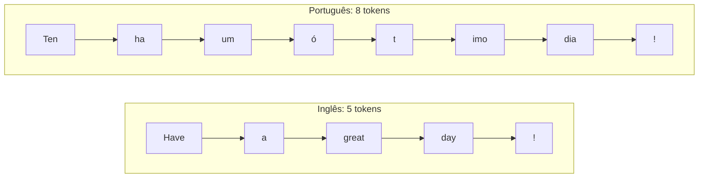
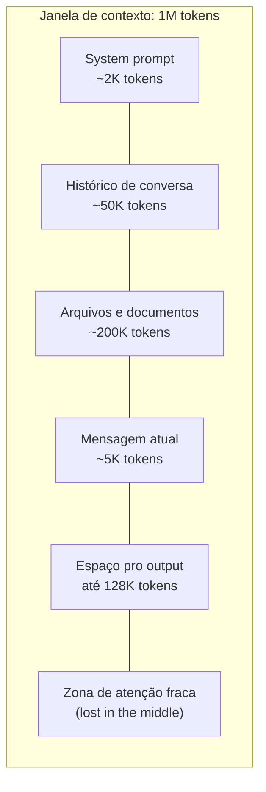
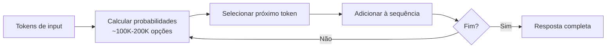
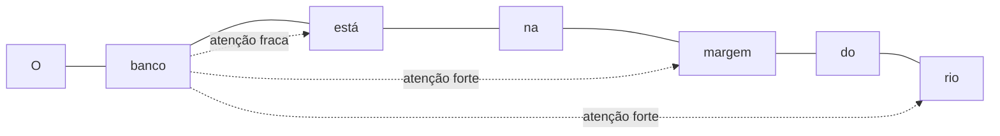

> * [O que é um token](#o-que-é-um-token)
> * [A janela de contexto](#a-janela-de-contexto)
> * [Como o modelo gera texto](#como-o-modelo-gera-texto)
> * [O mecanismo de atenção](#o-mecanismo-de-atenção)
> * [Temperatura e top-p](#temperatura-e-top-p)
> * [As famílias de modelos](#as-famílias-de-modelos)
> * [O que modelos não conseguem fazer](#o-que-modelos-não-conseguem-fazer)
> * [Quanto custa](#quanto-custa)
> * [Considerações finais](#considerações-finais)

No [artigo anterior](https://dev.to/rsicarelli/cc101-programacao-agentica), montamos a fábrica inteira: a evolução de produção manual pra máquinas autônomas, o ecossistema de ferramentas agênticas, os três pilares (prompt, context e harness engineering). Você sabe o que a fábrica faz, quem trabalha nela e até quanto fatura.

Mas as máquinas da fábrica constroem coisas. E pra entender como elas constroem, a melhor analogia que eu conheço é LEGO. Peças padronizadas que se encaixam uma por vez, seguindo (ou não) um manual, numa mesa com espaço limitado. O resultado pode ser impressionante, mas a mecânica é simples: uma peça de cada vez.

Este é o segundo artigo da série **Claude Code 101**, e aqui a gente desmonta essa mecânica. O que são tokens, como funciona a context window, por que modelos geram texto do jeito que geram, e por que eles às vezes erram com uma confiança desconcertante. Sem PhD, sem fórmula, sem enrolação. De dev pra dev.

---

## O que é um token

Computadores não entendem texto. Entendem números. Antes que um modelo de linguagem processe qualquer coisa que você escreveu, cada palavra, espaço e pontuação precisa virar uma sequência de inteiros. Esses inteiros são os **tokens**: as peças padronizadas com as quais o modelo trabalha.

Um token não é necessariamente uma palavra. Pode ser uma palavra inteira ("hello" vira 1 token), um pedaço de palavra ("tokenização" vira vários tokens), um caractere isolado ou até um byte. A regra prática pro inglês: **1 token corresponde a mais ou menos 4 caracteres**, ou cerca de 3/4 de uma palavra. Pro português, é mais perto de 1 token pra cada 3 caracteres.

### Como o vocabulário é construído

A maioria dos LLMs usa um algoritmo chamado **BPE** (Byte Pair Encoding) pra montar seu vocabulário. A lógica é simples: começa com os 256 valores possíveis de um byte, escaneia o corpus de treinamento, encontra o par de bytes mais frequente, junta num token novo, e repete. O resultado é um vocabulário que varia entre ~100 mil e ~200 mil tokens, dependendo do modelo.

O detalhe que importa: esse corpus de treinamento é dominado por texto em inglês. Palavras como "the", "and", "great" viram tokens únicos, peças inteiras. Palavras em português são fragmentadas em pedaços menores, como se o kit viesse com peças cortadas ao meio. Compare:

```
Inglês:    "Have a great day!"       → [Have] [a] [great] [day] [!]          = 5 tokens
Português: "Tenha um ótimo dia!"     → [Ten][ha] [um] [ó][t][imo] [dia][!]  = 8 tokens
```

O caractere "ó" sozinho já vira um token separado porque acentos aparecem pouco no corpus de treinamento. Não é detalhe técnico irrelevante. Afeta diretamente o seu bolso e a capacidade efetiva do modelo quando você trabalha em português.

### O imposto linguístico do português

Um estudo de Petrov et al. apresentado no NeurIPS 2023 mediu o que eles chamaram de "prêmio de tokenização" entre idiomas [[1]](#referências). Os números:

| Tokenizer | Quanto a mais o português consome vs inglês |
|---|---|
| GPT-2 (`r50k_base`) | **1.94x** (quase o dobro) |
| GPT-4 (`cl100k_base`) | **1.48x** (~50% a mais) |
| GPT-4o (`o200k_base`) | **~1.3-1.4x** (melhorou) |

A boa notícia: cada geração de tokenizer melhora essa disparidade. A notícia que importa: mesmo no melhor caso, português ainda consome pelo menos 30% mais peças que inglês pra construir a mesma coisa. Esse "imposto" vai reaparecer quando falarmos de context window e de custo, porque ele se acumula em cada interação.



---

## A janela de contexto

Se tokens são as peças, a context window é a mesa onde você monta. Tamanho fixo. Tudo precisa caber ali: as instruções que você mandou, o histórico da conversa, os arquivos de referência e a construção em andamento (o output do modelo). Quando a mesa enche, acabou. O modelo não "lembra" de nada que ficou de fora.

### As mesas de 2026

O mercado convergiu pra **1 milhão de tokens** como padrão nos modelos frontier [[2]](#referências):

| Modelo | Janela de contexto | Output máximo |
|---|---|---|
| **[Claude Opus 4.6](https://docs.anthropic.com/en/docs/about-claude/models)** | 1M tokens | 128K (sync), 300K (batch) |
| **[Claude Sonnet 4.6](https://docs.anthropic.com/en/docs/about-claude/models)** | 1M tokens | 64K (sync), 300K (batch) |
| **[Claude Haiku 4.5](https://docs.anthropic.com/en/docs/about-claude/models)** | 200K tokens | 64K |
| **[GPT-5.4](https://platform.openai.com/docs/models)** | 1.05M tokens | 128K |
| **[GPT-4.1](https://platform.openai.com/docs/models)** | 1M tokens | 32K |
| **[Gemini 2.5 Pro](https://ai.google.dev/gemini-api/docs/models)** | 1M tokens | 65K |
| **[Llama 4 Scout](https://ai.meta.com/blog/llama-4-multimodal-intelligence/)** | 10M tokens | varia |

Pra ter noção de escala: 1 milhão de tokens equivale a mais ou menos 750 mil palavras em inglês, algo como 10 livros inteiros. Pro português, por conta do imposto de tokenização, cai pra cerca de 500 mil palavras. Uns 7 livros.

### O tamanho anunciado vs. o tamanho real

Aqui entra um ponto que pouca gente discute. Ter uma mesa de 1 milhão de tokens não significa que o modelo usa bem toda essa superfície.

Pesquisas recentes (MECW, RULER, Chroma) mostram que a qualidade de atenção cai significativamente conforme o contexto cresce, especialmente pra informações posicionadas no meio do texto [[3]](#referências). O fenômeno tem até nome: **"lost in the middle"**. Na prática, a atenção efetiva do modelo fica em torno de **50-65% da janela anunciada**.

E aqui o imposto linguístico aparece de novo. Se a janela efetiva de um modelo com 200K tokens já é na prática uns 130K, pra conteúdo 100% em português, planeje como se fossem **~87K tokens de conteúdo equivalente**. A mesa encolhe cerca de **33%** em relação ao inglês. Peças maiores ocupam mais espaço na mesma superfície.



---

## Como o modelo gera texto

Você já sabe quais são as peças (tokens) e o tamanho da mesa (context window). Agora vem o processo de montagem em si.

A mecânica é surpreendentemente simples. O modelo olha pra tudo que já está na mesa, calcula uma distribuição de probabilidade sobre todo o vocabulário (entre ~100K e ~200K peças possíveis) pra decidir qual encaixa melhor na sequência, coloca uma, e repete. Uma de cada vez, do começo ao fim da resposta. Não existe um plano mestre. Isso se chama **geração autorregressiva** [[4]](#referências), e é a mecânica central da arquitetura Transformer publicada pelo Google em 2017.

```
Input:     "O céu está"
Passo 1:   P("azul")=0.25, P("nublado")=0.15, P("claro")=0.12, ...
           → seleciona "azul"
Passo 2:   "O céu está azul" → P("e")=0.20, P("hoje")=0.15, P(".")=0.10, ...
           → seleciona "hoje"
Passo 3:   "O céu está azul hoje" → P(".")=0.35, P(",")=0.12, ...
           → seleciona "."
Resultado: "O céu está azul hoje."
```

Cada peça colocada depende de todas as anteriores: tanto o input original quanto o que o modelo já construiu. Por isso respostas às vezes começam bem e descarrilham no meio. O modelo não sabe onde vai terminar quando começa a gerar.

Se você leu o artigo anterior, pode reconhecer esse mecanismo. Lembra do autocomplete, a fase 1 da evolução? O code completion que sugeria a próxima linha no editor? O mecanismo por baixo é o mesmo: next-token prediction. A diferença é a escala. Modelos como o GPT-2 (2019) tinham 1,5 bilhão de parâmetros e uma mesa minúscula. O Claude Opus 4.6 opera numa escala completamente diferente, com uma janela de contexto mil vezes maior. O processo de montagem é o mesmo. A capacidade de construir coisas complexas é que mudou.



---

## O mecanismo de atenção

O processo de montagem explica que o modelo coloca uma peça por vez. Mas falta entender como ele decide as probabilidades. Se a entrada é "O banco está na margem do rio", como o modelo sabe que "banco" aqui é uma formação de areia e não uma instituição financeira?

A resposta é o **mecanismo de atenção** (self-attention), introduzido no paper "Attention Is All You Need" [[4]](#referências). É o coração da arquitetura **Transformer** que sustenta todos os LLMs modernos.

### Olhar tudo ao mesmo tempo

Imagine que você tá montando e precisa decidir a próxima peça. A abordagem ingênua seria olhar só pra última peça colocada. Mas o mecanismo de atenção faz algo muito mais sofisticado: ele olha pra *tudo* que já está construído, simultaneamente, e calcula quanto cada parte é relevante pra decisão atual.

Antes dos Transformers, modelos processavam texto sequencialmente (palavra por palavra, da esquerda pra direita). O Transformer processa tudo de uma vez, em paralelo. Foi esse salto que viabilizou treinar modelos na escala atual.

### Desambiguação na prática

Volte pro exemplo: "O banco está na margem do rio." O mecanismo de atenção faz com que o token "banco" preste muita atenção nos tokens "margem" e "rio", e pouca atenção em "está" e "na". É como numa montagem onde uma peça azul pode ser céu ou mar dependendo do que está ao redor. O contexto resolve a ambiguidade.



Existe um custo nesse mecanismo. A atenção escala de forma **quadrática**: dobrar o tamanho do contexto quadruplica o custo computacional [[4]](#referências). É por isso que janelas de contexto maiores são exponencialmente mais caras de processar, e por que modelos cobram mais por token de output (cada token gerado exige um cálculo de atenção contra toda a sequência anterior).

### O que isso significa pra você

Se a atenção funciona ponderando a relevância de cada token em relação aos outros, prompts claros e bem estruturados facilitam o trabalho do modelo. Ambiguidade no input produz "confusão" na atenção: o modelo precisa distribuir pesos entre interpretações concorrentes. Um prompt preciso é como código limpo: a intenção fica óbvia e o mecanismo de atenção foca no que importa. Quanto mais organizada a mesa, mais precisa a próxima peça.

Isso não é abstração. É a base técnica de por que prompt engineering funciona, algo que vamos explorar a fundo na Part 6 desta série.

---

## Temperatura e top-p

Você já entende como o modelo pesa as opções. Mas quando vários tokens têm probabilidades próximas, quem decide qual é escolhido?

A diferença está entre seguir o manual ao pé da letra ou improvisar.

### Temperatura

A **temperatura** controla o quão previsível o modelo é na hora de selecionar o próximo token. Com temperatura 0, ele sempre escolhe o token mais provável (chamado de *greedy decoding*). Saída determinística, repetível. Como seguir um manual de montagem: cada passo tem uma única opção correta.

Conforme a temperatura sobe, o modelo começa a improvisar, explorando tokens menos prováveis. Com 0.7, ele segue a ideia geral mas faz escolhas que você não esperaria. Acima de 1.0, as escolhas ficam cada vez mais aleatórias. Peças encaixadas sem critério.

| Temperatura | Completando "A receita leva..." | Comportamento |
|---|---|---|
| 0.0 | "farinha, ovos e açúcar." | Sempre a mesma resposta |
| 0.3 | "farinha de trigo, manteiga e ovos." | Pequenas variações |
| 0.7 | "especiarias exóticas e um toque de limão siciliano." | Criativo |
| 1.5 | "sonhos derretidos em caramelo de dragão." | Incoerente |

### Top-p

O **top-p** (ou *nucleus sampling*) funciona de forma diferente. Em vez de escalar as probabilidades, ele limita o estoque de peças disponíveis pra aquele encaixe. Com top-p de 0.9, o modelo considera apenas os tokens cuja probabilidade acumulada soma 90%, descartando a cauda longa de opções improváveis. Quando o modelo está confiante (um token domina), poucos tokens entram na seleção. Quando está incerto, mais opções são consideradas.

A regra prática: ajuste temperatura **ou** top-p, não os dois ao mesmo tempo. O efeito combinado é difícil de prever. Na maioria dos casos, temperatura é o parâmetro mais usado.

### Guia por caso de uso

| Caso de uso | Temperatura | Top-p |
|---|---|---|
| Geração de código | 0.0 - 0.2 | 0.9 |
| Extração de dados / JSON | 0.0 | 1.0 |
| Chatbot de suporte | 0.3 - 0.5 | 0.9 |
| Tradução | 0.2 - 0.3 | 0.9 |
| Escrita criativa | 0.7 - 1.0 | 0.95 |
| Brainstorming | 0.9 - 1.2 | 0.95 |

Pra geração de código (o que mais nos interessa nesta série), temperatura baixa é quase sempre a resposta certa. Você quer consistência, não improviso.

---

## As famílias de modelos

Nem toda peça serve pra toda construção. LEGO Duplo (peças grandes, simples) é perfeito pra quem está começando, mas não dá pra construir um motor funcional com ele. LEGO Technic (engrenagens, eixos, complexidade) permite construções sofisticadas, mas é mais caro e exige mais tempo. A mesma lógica vale pra modelos de linguagem.

### Modelos de raciocínio

Os kits Technic: "pensam antes de responder", gastando tokens internos em raciocínio passo a passo (extended thinking) antes de produzir a resposta final. São os mais capazes, mais lentos e mais caros.

- **Claude Opus 4.6** (Anthropic) lidera benchmarks de código (80.8% no SWE-bench) [[5]](#referências). $5/$25 por MTok.
- **o3 / o3-pro** (OpenAI) são modelos de raciocínio dedicados. O o3-pro custa $20/$80 por MTok.
- **Gemini 2.5 Pro** (Google) permite configurar o "orçamento de raciocínio". $1.25/$10 por MTok.

### Modelos rápidos

Os kits Duplo: peças maiores, encaixe rápido, resultado imediato. Projetados pra latência baixa e alto volume.

- **Claude Haiku 4.5** (Anthropic): $1/$5 por MTok.
- **GPT-4o-mini** (OpenAI): $0.15/$0.60 por MTok.
- **Gemini 2.5 Flash** (Google): $0.30/$2.50 por MTok.

### Modelos de código

Kits otimizados pra construções específicas. Como a linha Creator Expert, onde cada set é projetado pra um resultado particular.

- **GPT-4.1** (OpenAI): 1M de contexto, $2/$8 por MTok. Explicitamente otimizado pra código.
- **[Claude Code](https://docs.anthropic.com/en/docs/claude-code)** (Anthropic): usa Opus/Sonnet por baixo, mas com um harness inteiro de ferramentas pra ler, editar, executar e fazer commit.

### Modelos open-weight

Kits com todas as peças expostas: você monta, desmonta e adapta como quiser.

- **Llama 4 Scout** (Meta): 10M de contexto, open-weight [[6]](#referências).
- **Llama 4 Maverick** (Meta): 1M de contexto, 17B parâmetros ativos de 400B total.
- **DeepSeek R1**: open-source (MIT), 671B parâmetros, raciocínio forte.

### Escolhendo o kit certo

Usar Opus pra classificar sentimento de tweets é como comprar um Technic de 4 mil peças pra construir um cubo. A diferença entre Haiku ($1/$5 por MTok) e Opus ($5/$25 por MTok) é **5x no input e 5x no output**. Muita tarefa que parece "precisar" de um modelo grande funciona perfeitamente com um modelo menor.

A regra prática: comece sempre pelo modelo mais barato que pode funcionar. Teste com Haiku, Flash ou mini. Se a qualidade não for suficiente, suba. Opus e o3-pro ficam reservados pra quando realmente necessário.

Mas independente do kit que você escolher, todos compartilham as mesmas limitações fundamentais.

---

## O que modelos não conseguem fazer

A construção pode parecer perfeita. Visualmente impecável, cada peça no lugar. Mas empurre a parede e ela cai. O modelo não "sabe" se o que construiu funciona. Ele encaixa peças onde elas parecem caber, seguindo padrões estatísticos, e o resultado frequentemente se sustenta. Mas nem sempre.

### Alucinações não são bugs

Quando um modelo gera informação que parece correta mas é factualmente falsa, chamamos de **alucinação** (hallucination). É tentador tratar isso como defeito, algo que será "consertado" numa versão futura. Mas alucinações são uma consequência direta do design: o modelo encaixa peças onde elas parecem caber estatisticamente, sem checar se a construção faz sentido no mundo real [[4]](#referências).

Se o padrão estatístico de "X escreveu o livro Y" é forte o bastante nos dados de treinamento, o modelo vai afirmar isso mesmo se for falso. Ele não tem um verificador de fatos interno. Não distingue entre gerar "Paris é a capital da França" e "Paris é a capital da Itália". Ambas são sequências de tokens plausíveis; uma é verdade, a outra não, e o modelo não sabe a diferença.

### As limitações concretas

Sem ferramentas externas (web search, APIs), o modelo só sabe o que existia até a data de corte do treinamento. Não tem memória entre chamadas: cada request à API é independente, como uma função stateless. A mesa é limpa entre uma montagem e outra. Persistência é responsabilidade da sua aplicação.

Matemática continua sendo um ponto fraco, apesar de melhorias enormes nos últimos dois anos. Pra cálculos que exigem precisão, tool calling (delegar pro Python, por exemplo) é mais confiável do que confiar no modelo.

E no contexto de código, os dados do artigo anterior continuam valendo: código gerado por IA carrega **2.74x mais vulnerabilidades** segundo a Veracode [[7]](#referências). A fábrica automatizada produz mais rápido, mas sem controle de qualidade, produz defeitos mais rápido também.

### O que está melhorando

Vale mencionar que a comunidade não está parada. Técnicas como **Chain-of-thought** (pedir pro modelo "pensar passo a passo") melhoram significativamente o raciocínio em tarefas complexas. **RAG** (Retrieval-Augmented Generation) dá ao modelo acesso a dados atualizados e privados.

Na mesma direção, **function calling** e **tool use** permitem que o modelo aja no mundo (consultar APIs, executar código, buscar na web), e **fine-tuning** adapta o comportamento ao seu domínio específico. Cada uma dessas técnicas constrói em cima do que você acabou de aprender, e vai ganhar profundidade nos artigos dedicados desta série.

Mesmo com limitações, esses modelos estão sendo usados em escala. E escala tem um custo.

---

## Quanto custa

Cada peça custa dinheiro. LLMs são cobrados por token processado, dividido em duas categorias: **input tokens** (tudo que você envia) e **output tokens** (o que o modelo gera). Construir algo novo (output) sempre custa mais que consultar o que já existe (input), geralmente entre 3x e 5x o preço [[8]](#referências). Faz sentido: gerar cada token exige um forward pass completo pelo modelo.

### Tabela de preços (abril 2026)

Preços em USD por 1 milhão de tokens (MTok):

| Modelo | Input / MTok | Output / MTok | Cache read / MTok |
|---|---|---|---|
| **Claude Opus 4.6** | $5.00 | $25.00 | $0.50 |
| **Claude Sonnet 4.6** | $3.00 | $15.00 | $0.30 |
| **Claude Haiku 4.5** | $1.00 | $5.00 | $0.10 |
| **GPT-5.4** | $2.50 | $15.00 | $0.25 |
| **GPT-4.1** | $2.00 | $8.00 | $0.50 |
| **Gemini 2.5 Pro** | $1.25 | $10.00 | $0.125 |
| **Gemini 2.5 Flash** | $0.30 | $2.50 | $0.03 |

Repare na coluna "Cache read". Ela vai ser importante daqui a pouco.

### O imposto linguístico fecha o ciclo

Lembra do custo de tokenização do português? Ele se traduz diretamente em dinheiro. Pro mesmo conteúdo, aplicações em português custam **~50% a mais** em tokens de input do que a mesma aplicação em inglês. Numa conta de $5.000/mês, isso representa cerca de $1.650 extras só por causa do idioma.

Ao longo deste artigo, um fio conecta três seções: o português consome mais peças pra construir a mesma coisa (seção 1), isso ocupa mais espaço na mesa (seção 2), e agora cobra mais caro (aqui). Não são três problemas. É o mesmo problema, em três camadas.

### Como otimizar

A boa notícia: existem formas concretas de reduzir esse custo.

**Prompt caching** é a mais impactante. Todos os grandes providers oferecem cache reads a cerca de 10% do preço de input [[8]](#referências). Se o seu system prompt ou contexto de referência se repete entre chamadas, caching pode reduzir o custo de input em até **90%**. Isso mitiga significativamente o imposto linguístico do português.

**Batch API** oferece 50% de desconto em troca de processamento assíncrono (janela de 24h). Pra tarefas que não são real-time (análise de documentos, classificação em massa), é dinheiro fácil de economizar.

**Seleção de modelo** é a terceira alavanca. Muitas tarefas que rodam em Opus funcionariam tão bem em Haiku, a uma fração do custo. Testar com o modelo mais barato primeiro não é otimização prematura. É engenharia responsável.

Combinando batch + caching na Anthropic, o desconto pode chegar a **95%** em cenários ideais [[8]](#referências).

Esse tema vai ser central na Part 4, quando falarmos de context engineering. Gerenciar o que vai na mesa é, na prática, gerenciar dinheiro.

---

## Considerações finais

Agora você entende a mecânica. Texto vira peças padronizadas, a mesa tem tamanho fixo, a construção acontece uma peça por vez, o modelo olha tudo ao mesmo tempo pra decidir a próxima, e o resultado pode parecer impecável sem ter integridade nenhuma por baixo. Pra quem escreve em português, a mesa é menor e cada peça custa mais.

Mas entender a mecânica não resolve o problema central: um monte de peças soltas não constrói nada sozinho. Precisa de instruções, de uma mesa organizada, de alguém que confira a construção e corrija quando algo sai errado. Esse sistema que envolve e orquestra o modelo tem um nome: **harness**.

O próximo artigo abre o Claude Code por dentro. Vamos ver como o harness funciona, como o agentic loop opera (o ciclo de planejar, executar, observar e corrigir), quais ferramentas o agente tem à disposição e por que, no fim, não tem mágica ali. Só software bem feito orquestrando chamadas de API.

**Desmistificando o Claude Code** é o próximo passo. Te vejo lá.

---

> 🤖 Este artigo foi escrito com assistência do Claude (Anthropic).
>
> Conteúdo pesquisado, verificado e editado por um humano.
>
> Encontrou algum erro ou crédito faltando? Me manda uma mensagem!

---

## Referências

1. [Petrov, A. et al. — "Language Model Tokenizers Introduce Unfairness Between Languages" (NeurIPS 2023)](https://arxiv.org/abs/2305.15425)
2. [Anthropic — Claude model documentation (2026)](https://docs.anthropic.com/en/docs/about-claude/models)
3. [Liu, N.F. et al. — "Lost in the Middle: How Language Models Use Long Contexts" (2023)](https://arxiv.org/abs/2307.03172)
4. [Vaswani, A. et al. — "Attention Is All You Need" (NeurIPS 2017)](https://arxiv.org/abs/1706.03762)
5. [SWE-bench](https://www.swebench.com/) — Princeton NLP (ICLR 2024)
6. [Meta — Llama 4 announcement (2025)](https://ai.meta.com/blog/llama-4-multimodal-intelligence/)
7. [Veracode — "GenAI and Code Security: What You Need to Know" (2025)](https://www.veracode.com/resources/analyst-reports/2025-genai-code-security-report/)
8. [Anthropic — API Pricing (2026)](https://www.anthropic.com/pricing)
